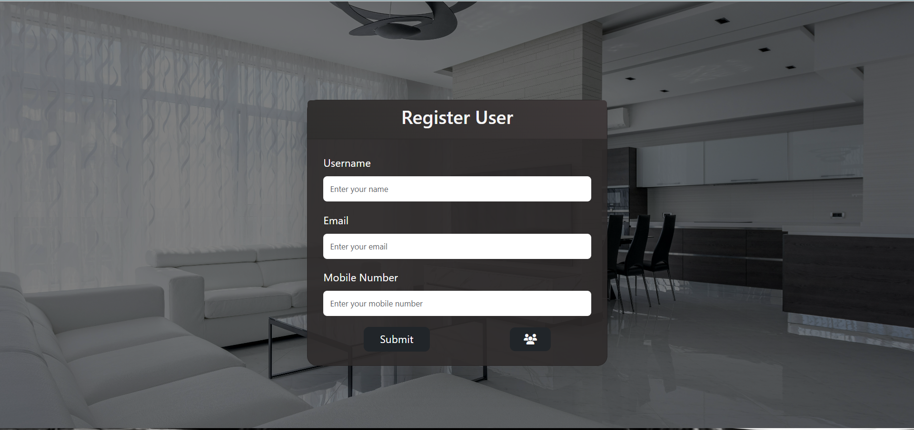
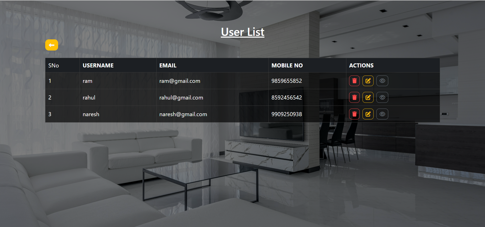

React Redux User Management App
This project is a User Management System built using React and Redux Toolkit. The app provides a simple interface to Add, View, Update, and Delete (CRUD) user information. It utilizes React Hook Form for form handling, React Router DOM for navigation, and Bootstrap for styling.

Features
Add a new user with details like Username, Email, and Mobile Number.
View the list of all users in a table format.
Update existing user details.
Delete users with confirmation.
Form validation with React Hook Form.
Smooth navigation using React Router.
Technologies Used
React (version 18.3.1)
Redux Toolkit (version 2.3.0)
React Router DOM (version 6.26.2)
React Hook Form (version 7.53.0)
Axios (version 1.7.7)
Bootstrap (version 5.3.3)
UUID4 (version 2.0.3)

Usage
Adding a New User
Navigate to the Add User section.
Fill in the Username, Email, and Mobile Number fields.
Click the Submit button to add the user.
Viewing Users
Go to the User List page.
View all users in a tabular format.
Use the Update button to edit user details or the Delete button to remove a user.
Updating User Details
Click on the Update button next to a user's details.
Edit the fields as needed and click Submit to save changes.
Deleting a User
Click the Delete button next to a user's details.
Confirm the action in the popup.
Screenshots
1. User List Page

2. Add New User Form

3. Update User Form

  
